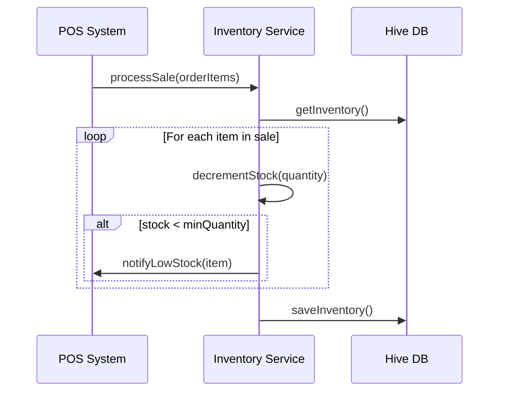

# TECHNICAL SPEC - Gestão de Estoque (v2.2.0)

## 1. Visão Geral
Sistema de controle de inventário para monitorar a disponibilidade de produtos e insumos.

## 2. Modelagem de Dados
```json
{
  "InventoryItem": {
    "productId": "String",
    "currentQuantity": "Double",
    "minQuantity": "Double",
    "unit": "ENUM(KG, UN, LT, GR)",
    "lastRestock": "ISO8601",
    "status": "ENUM(IN_STOCK, LOW_STOCK, OUT_OF_STOCK)"
  }
}
```

## 3. Fluxo de Execução (Diagrama de Sequência)


## 4. Regras de Concorrência
- As baixas de estoque devem ser atômicas durante a finalização do pedido.
- Sincronização local via Hive.

## 5. Edge Cases
- Venda de produto com estoque zero (permitir ou bloquear via configuração).
- Ajuste manual de estoque por perda ou quebra.
