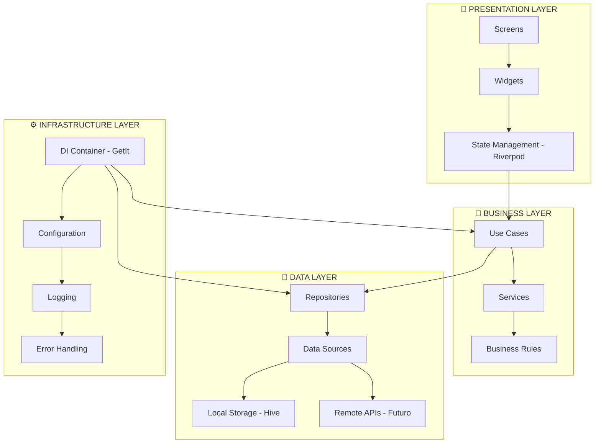
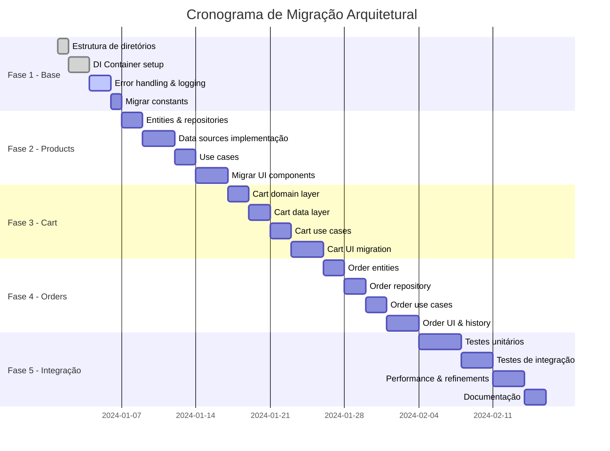

# 📐 **PLANO DE REFATORAÇÃO ARQUITETURAL - PDV FLUTTER**

*Análise completa e proposta de reestruturação do sistema PDV*

---

## 📊 **1. ANÁLISE DA ESTRUTURA ATUAL**

### ✅ **Pontos Positivos Identificados**
- **UI Framework**: Uso consistente do Fluent UI com tema bem estruturado
- **State Management**: Gerenciamento de estado com Provider implementado adequadamente
- **Organização Básica**: Separação inicial entre [`models`](lib/models), [`providers`](lib/providers), [`screens`](lib/screens) e [`widgets`](lib/widgets)
- **Constantes**: [`AppConstants`](lib/constants/app_constants.dart) bem organizados com padrão de cores, tamanhos e breakpoints
- **Componentização**: Widgets modulares especialmente no sistema de carrinho
- **Responsividade**: Implementação de breakpoints e design adaptativo

### ❌ **Problemas Arquiteturais Críticos**

#### **1. Acoplamento Alto**
- **Problema**: [`ProductProvider`](lib/providers/product_provider.dart) acessa diretamente [`MockData`](lib/utils/mock_data.dart) sem abstração
- **Impacto**: Impossível trocar fonte de dados sem modificar lógica de negócio

#### **2. Ausência de Camada de Dados**
- **Problema**: Sem Repository Pattern ou Data Sources abstratos
- **Impacto**: Preparação futura para APIs comprometida

#### **3. Lógica de Negócio Misturada**
- **Problema**: Business logic dentro dos Providers (ex: [`CartProvider.createOrder()`](lib/providers/cart_provider.dart:78))
- **Impacto**: Difícil reutilização e testabilidade

#### **4. Falta de Dependency Injection**
- **Problema**: Dependências hard-coded no [`main.dart`](lib/main.dart:18-23)
- **Impacto**: Baixa flexibilidade e testabilidade

#### **5. Escalabilidade Comprometida**
- **Problema**: Estrutura monolítica não suporta crescimento modular
- **Impacto**: Adição de novas funcionalidades cada vez mais complexa

---

## 🏗️ **2. NOVA ARQUITETURA PROPOSTA**

### **Arquitetura Clean com Modularização por Domínio**



### **📁 Estrutura de Diretórios Detalhada**

```
lib/
├── core/                          # 🌟 Núcleo compartilhado
│   ├── di/                        # 💉 Dependency Injection
│   │   ├── service_locator.dart
│   │   └── injection_container.dart
│   ├── error/                     # 🚨 Tratamento de erros
│   │   ├── exceptions.dart
│   │   ├── failures.dart
│   │   └── error_handler.dart
│   ├── utils/                     # 🛠️ Utilitários globais
│   │   ├── logger.dart
│   │   ├── constants.dart
│   │   └── extensions.dart
│   └── config/                    # ⚙️ Configurações
│       ├── app_config.dart
│       └── environment.dart
│
├── shared/                        # 🤝 Componentes compartilhados
│   ├── presentation/
│   │   ├── widgets/               # 🧩 Widgets reutilizáveis
│   │   │   ├── buttons/
│   │   │   ├── cards/
│   │   │   └── dialogs/
│   │   └── themes/                # 🎨 Temas e estilos
│   │       ├── app_theme.dart
│   │       └── color_schemes.dart
│   ├── domain/
│   │   ├── entities/              # 📝 Entidades base
│   │   │   └── base_entity.dart
│   │   └── value_objects/         # 💎 Objetos de valor
│   │       ├── money.dart
│   │       └── quantity.dart
│   └── infrastructure/
│       ├── storage/               # 💾 Storage local
│       │   └── local_storage.dart
│       └── network/               # 🌐 Network (futuro)
│           └── api_client.dart
│
├── features/                      # 🎯 Módulos por domínio
│   ├── products/
│   │   ├── domain/
│   │   │   ├── entities/
│   │   │   │   ├── product.dart
│   │   │   │   └── category.dart
│   │   │   ├── repositories/
│   │   │   │   └── product_repository.dart
│   │   │   └── use_cases/
│   │   │       ├── get_products.dart
│   │   │       ├── search_products.dart
│   │   │       └── filter_by_category.dart
│   │   ├── data/
│   │   │   ├── repositories/
│   │   │   │   └── product_repository_impl.dart
│   │   │   ├── data_sources/
│   │   │   │   ├── product_local_data_source.dart
│   │   │   │   └── product_remote_data_source.dart
│   │   │   └── models/
│   │   │       ├── product_model.dart
│   │   │       └── category_model.dart
│   │   └── presentation/
│   │       ├── providers/
│   │       │   └── product_provider.dart
│   │       ├── screens/
│   │       │   └── product_menu_screen.dart
│   │       └── widgets/
│   │           ├── product_card.dart
│   │           ├── category_tabs.dart
│   │           └── product_grid.dart
│   │
│   ├── cart/
│   │   ├── domain/
│   │   │   ├── entities/
│   │   │   │   ├── cart_item.dart
│   │   │   │   └── cart.dart
│   │   │   ├── repositories/
│   │   │   │   └── cart_repository.dart
│   │   │   └── use_cases/
│   │   │       ├── add_to_cart.dart
│   │   │       ├── remove_from_cart.dart
│   │   │       ├── update_quantity.dart
│   │   │       └── calculate_totals.dart
│   │   ├── data/
│   │   │   ├── repositories/
│   │   │   │   └── cart_repository_impl.dart
│   │   │   ├── data_sources/
│   │   │   │   └── cart_local_data_source.dart
│   │   │   └── models/
│   │   │       ├── cart_item_model.dart
│   │   │       └── cart_model.dart
│   │   └── presentation/
│   │       ├── providers/
│   │       │   └── cart_provider.dart
│   │       ├── widgets/
│   │       │   ├── cart_panel.dart
│   │       │   ├── cart_item_card.dart
│   │       │   ├── checkout_section.dart
│   │       │   └── cart_summary.dart
│   │       └── screens/
│   │           └── cart_screen.dart
│   │
│   └── orders/
│       ├── domain/
│       │   ├── entities/
│       │   │   └── order.dart
│       │   ├── repositories/
│       │   │   └── order_repository.dart
│       │   └── use_cases/
│       │       ├── create_order.dart
│       │       ├── get_order_history.dart
│       │       └── calculate_order_totals.dart
│       ├── data/
│       │   ├── repositories/
│       │   │   └── order_repository_impl.dart
│       │   ├── data_sources/
│       │   │   ├── order_local_data_source.dart
│       │   │   └── order_remote_data_source.dart
│       │   └── models/
│       │       └── order_model.dart
│       └── presentation/
│           ├── providers/
│           │   └── order_provider.dart
│           ├── screens/
│           │   ├── order_history_screen.dart
│           │   └── order_confirmation_screen.dart
│           └── widgets/
│               ├── order_summary.dart
│               ├── order_item.dart
│               └── order_status_badge.dart
│
└── app/                          # 🚀 Configuração da aplicação
    ├── app.dart                  # Widget principal
    ├── router/                   # 🛣️ Configuração de rotas
    │   ├── app_router.dart
    │   └── route_paths.dart
    └── themes/                   # 🎨 Temas da aplicação
        ├── app_theme.dart
        ├── light_theme.dart
        └── dark_theme.dart
```

---

## 🎨 **3. PADRÕES DE DESIGN A IMPLEMENTAR**

### **🏪 Repository Pattern**

```dart
// Domain Layer - Interface
abstract class ProductRepository {
  Future<Either<Failure, List<Product>>> getProducts();
  Future<Either<Failure, List<Product>>> searchProducts(String query);
  Future<Either<Failure, List<Product>>> getProductsByCategory(String category);
  Future<Either<Failure, Product?>> getProductById(String id);
}

// Data Layer - Implementação
class ProductRepositoryImpl implements ProductRepository {
  final ProductLocalDataSource localDataSource;
  final ProductRemoteDataSource remoteDataSource;
  final NetworkInfo networkInfo;
  
  ProductRepositoryImpl({
    required this.localDataSource,
    required this.remoteDataSource,
    required this.networkInfo,
  });
  
  @override
  Future<Either<Failure, List<Product>>> getProducts() async {
    if (await networkInfo.isConnected) {
      try {
        final remoteProducts = await remoteDataSource.getProducts();
        await localDataSource.cacheProducts(remoteProducts);
        return Right(remoteProducts.map((model) => model.toEntity()).toList());
      } on ServerException {
        return Left(ServerFailure());
      }
    } else {
      try {
        final localProducts = await localDataSource.getProducts();
        return Right(localProducts.map((model) => model.toEntity()).toList());
      } on CacheException {
        return Left(CacheFailure());
      }
    }
  }
}
```

### **🏭 Factory Pattern**

```dart
// Para criação de objetos complexos
abstract class OrderFactory {
  static Order createFromCart(Cart cart, {TaxStrategy? taxStrategy}) {
    final strategy = taxStrategy ?? StandardTaxStrategy();
    final subtotal = cart.subtotal;
    final tax = strategy.calculate(subtotal);
    
    return Order(
      id: _generateOrderId(),
      items: cart.items,
      createdAt: DateTime.now(),
      subtotal: subtotal,
      tax: tax,
      total: subtotal + tax,
      status: OrderStatus.pending,
    );
  }
  
  static String _generateOrderId() {
    return 'ORDER_${DateTime.now().millisecondsSinceEpoch}';
  }
}

// Factory para diferentes tipos de produtos
abstract class ProductFactory {
  static Product createBurger({
    required String name,
    required String description,
    required double price,
    required String imageUrl,
  }) {
    return Product(
      id: _generateProductId(),
      name: name,
      description: description,
      price: Money(price),
      imageUrl: imageUrl,
      category: ProductCategory.burger,
      availableQuantity: Quantity(0),
    );
  }
}
```

### **⚡ Strategy Pattern**

```dart
// Para algoritmos intercambiáveis
abstract class TaxCalculationStrategy {
  double calculate(double subtotal);
  String get name;
}

class StandardTaxStrategy implements TaxCalculationStrategy {
  @override
  double calculate(double subtotal) => subtotal * 0.10;
  
  @override
  String get name => 'Taxa Padrão (10%)';
}

class PromoTaxStrategy implements TaxCalculationStrategy {
  @override
  double calculate(double subtotal) => subtotal * 0.05;
  
  @override
  String get name => 'Taxa Promocional (5%)';
}

class HolidayTaxStrategy implements TaxCalculationStrategy {
  @override
  double calculate(double subtotal) => 0.0;
  
  @override
  String get name => 'Taxa Feriado (0%)';
}

// Context para usar estratégias
class TaxCalculator {
  TaxCalculationStrategy _strategy;
  
  TaxCalculator(this._strategy);
  
  void setStrategy(TaxCalculationStrategy strategy) {
    _strategy = strategy;
  }
  
  double calculateTax(double subtotal) => _strategy.calculate(subtotal);
  String get currentStrategyName => _strategy.name;
}
```

### **💉 Dependency Injection com GetIt**

```dart
// core/di/service_locator.dart
final sl = GetIt.instance;

Future<void> initializeDependencies() async {
  // External
  await _initExternal();
  
  // Core
  _initCore();
  
  // Features
  await _initProducts();
  await _initCart();
  await _initOrders();
}

Future<void> _initExternal() async {
  // Hive para storage local
  await Hive.initFlutter();
  
  // Registrar adapters do Hive
  Hive.registerAdapter(ProductModelAdapter());
  Hive.registerAdapter(CartItemModelAdapter());
  
  // Storage boxes
  final productBox = await Hive.openBox<ProductModel>('products');
  final cartBox = await Hive.openBox<CartItemModel>('cart');
  
  sl.registerLazySingleton(() => productBox);
  sl.registerLazySingleton(() => cartBox);
}

void _initCore() {
  // Logger
  sl.registerLazySingleton<AppLogger>(() => AppLogger());
  
  // Network Info
  sl.registerLazySingleton<NetworkInfo>(() => NetworkInfoImpl());
  
  // Tax Calculator com estratégia padrão
  sl.registerLazySingleton<TaxCalculator>(
    () => TaxCalculator(StandardTaxStrategy()),
  );
}

Future<void> _initProducts() async {
  // Data Sources
  sl.registerLazySingleton<ProductLocalDataSource>(
    () => ProductLocalDataSourceImpl(productBox: sl()),
  );
  
  sl.registerLazySingleton<ProductRemoteDataSource>(
    () => ProductRemoteDataSourceImpl(client: sl()),
  );
  
  // Repository
  sl.registerLazySingleton<ProductRepository>(
    () => ProductRepositoryImpl(
      localDataSource: sl(),
      remoteDataSource: sl(),
      networkInfo: sl(),
    ),
  );
  
  // Use Cases
  sl.registerLazySingleton(() => GetProducts(sl()));
  sl.registerLazySingleton(() => SearchProducts(sl()));
  sl.registerLazySingleton(() => FilterProductsByCategory(sl()));
  
  // Providers
  sl.registerFactory(() => ProductProvider(
    getProducts: sl(),
    searchProducts: sl(),
    filterByCategory: sl(),
  ));
}

Future<void> _initCart() async {
  // Data Sources
  sl.registerLazySingleton<CartLocalDataSource>(
    () => CartLocalDataSourceImpl(cartBox: sl()),
  );
  
  // Repository
  sl.registerLazySingleton<CartRepository>(
    () => CartRepositoryImpl(localDataSource: sl()),
  );
  
  // Use Cases
  sl.registerLazySingleton(() => AddToCart(sl()));
  sl.registerLazySingleton(() => RemoveFromCart(sl()));
  sl.registerLazySingleton(() => UpdateCartItemQuantity(sl()));
  sl.registerLazySingleton(() => CalculateCartTotals(sl(), sl()));
  sl.registerLazySingleton(() => ClearCart(sl()));
  
  // Providers
  sl.registerFactory(() => CartProvider(
    addToCart: sl(),
    removeFromCart: sl(),
    updateQuantity: sl(),
    calculateTotals: sl(),
    clearCart: sl(),
  ));
}

Future<void> _initOrders() async {
  // Data Sources
  sl.registerLazySingleton<OrderLocalDataSource>(
    () => OrderLocalDataSourceImpl(),
  );
  
  sl.registerLazySingleton<OrderRemoteDataSource>(
    () => OrderRemoteDataSourceImpl(client: sl()),
  );
  
  // Repository
  sl.registerLazySingleton<OrderRepository>(
    () => OrderRepositoryImpl(
      localDataSource: sl(),
      remoteDataSource: sl(),
      networkInfo: sl(),
    ),
  );
  
  // Use Cases
  sl.registerLazySingleton(() => CreateOrder(sl()));
  sl.registerLazySingleton(() => GetOrderHistory(sl()));
  sl.registerLazySingleton(() => CalculateOrderTotals(sl()));
  
  // Providers
  sl.registerFactory(() => OrderProvider(
    createOrder: sl(),
    getOrderHistory: sl(),
    calculateTotals: sl(),
  ));
}
```

---

## 🔄 **4. PLANO DE MIGRAÇÃO STEP-BY-STEP**

### **📅 Cronograma Detalhado**



### **🏗️ Fase 1: Preparação e Estrutura Base (Dias 1-7)**

#### **Objetivos**
- Criar nova estrutura de diretórios
- Implementar sistema de DI
- Setup de logging e error handling
- Migrar constantes para estrutura modular

#### **Deliverables**
- [ ] Estrutura de pastas completa
- [ ] Service Locator configurado
- [ ] Sistema de logging funcionando
- [ ] Error handling centralizado
- [ ] AppConfig migrado

### **🎯 Fase 2: Módulo Products (Dias 8-17)**

#### **Objetivos**
- Implementar domain layer completo
- Criar data sources abstratos
- Implementar use cases
- Migrar UI existente

#### **Deliverables**
- [ ] [`Product`](features/products/domain/entities/product.dart) e [`Category`](features/products/domain/entities/category.dart) entities
- [ ] [`ProductRepository`](features/products/domain/repositories/product_repository.dart) interface
- [ ] [`ProductLocalDataSource`](features/products/data/data_sources/product_local_data_source.dart) implementado
- [ ] Use cases: [`GetProducts`](features/products/domain/use_cases/get_products.dart), [`SearchProducts`](features/products/domain/use_cases/search_products.dart), [`FilterByCategory`](features/products/domain/use_cases/filter_by_category.dart)
- [ ] [`ProductProvider`](features/products/presentation/providers/product_provider.dart) refatorado
- [ ] [`ProductCard`](features/products/presentation/widgets/product_card.dart) migrado

### **🛒 Fase 3: Módulo Cart (Dias 18-26)**

#### **Objetivos**
- Criar domain layer do carrinho
- Implementar persistência local
- Criar use cases para operações do carrinho
- Migrar componentes UI existentes

#### **Deliverables**
- [ ] [`Cart`](features/cart/domain/entities/cart.dart) e [`CartItem`](features/cart/domain/entities/cart_item.dart) entities
- [ ] [`CartRepository`](features/cart/domain/repositories/cart_repository.dart) com persistência
- [ ] Use cases do carrinho implementados
- [ ] [`CartProvider`](features/cart/presentation/providers/cart_provider.dart) refatorado
- [ ] [`CartPanel`](features/cart/presentation/widgets/cart_panel.dart) e componentes migrados

### **📋 Fase 4: Módulo Orders (Dias 27-35)**

#### **Objetivos**
- Implementar sistema de pedidos
- Criar histórico de pedidos
- Implementar cálculos avançados
- UI para confirmação e histórico

#### **Deliverables**
- [ ] [`Order`](features/orders/domain/entities/order.dart) entity completa
- [ ] [`OrderRepository`](features/orders/domain/repositories/order_repository.dart) com persistência
- [ ] [`CreateOrder`](features/orders/domain/use_cases/create_order.dart), [`GetOrderHistory`](features/orders/domain/use_cases/get_order_history.dart) use cases
- [ ] [`OrderProvider`](features/orders/presentation/providers/order_provider.dart) implementado
- [ ] Telas de confirmação e histórico

### **✅ Fase 5: Integração e Qualidade (Dias 36-49)**

#### **Objetivos**
- Testes abrangentes
- Performance optimization
- Documentação completa
- Validação final

#### **Deliverables**
- [ ] 90%+ cobertura de testes unitários
- [ ] Testes de integração end-to-end
- [ ] Performance benchmarks
- [ ] Documentação técnica completa

---

## 📦 **5. DEPENDÊNCIAS NECESSÁRIAS**

### **📋 pubspec.yaml Atualizado**

```yaml
name: pdv_restaurant
description: "Sistema PDV moderno com arquitetura Clean"
publish_to: 'none'
version: 2.0.0+1

environment:
  sdk: ^3.7.2

dependencies:
  # 🎨 UI Framework
  flutter:
    sdk: flutter
  fluent_ui: ^4.9.1
  fluentui_icons: ^1.0.0
  
  # 🔄 State Management
  riverpod: ^2.4.9
  flutter_riverpod: ^2.4.9
  
  # 💉 Dependency Injection
  get_it: ^7.6.4
  injectable: ^2.3.2
  
  # 🎯 Functional Programming
  dartz: ^0.10.1
  equatable: ^2.0.5
  
  # 💾 Storage Local
  hive: ^2.2.3
  hive_flutter: ^1.1.0
  path_provider: ^2.1.1
  
  # 🌐 Network (futuro)
  dio: ^5.4.0
  connectivity_plus: ^5.0.2
  
  # 🛠️ Utilities
  intl: ^0.19.0
  uuid: ^4.2.1
  freezed_annotation: ^2.4.1
  
  # 📊 Logging
  logger: ^2.0.2+1
  
  # 🔧 JSON & Serialization
  json_annotation: ^4.8.1
  
  # 🛣️ Navigation
  go_router: ^14.6.1
  
  # 🎭 Icons adicionais
  cupertino_icons: ^1.0.8

dev_dependencies:
  # 🧪 Testing
  flutter_test:
    sdk: flutter
  mockito: ^5.4.4
  bloc_test: ^9.1.5
  
  # 🏗️ Code Generation
  build_runner: ^2.4.7
  injectable_generator: ^2.4.1
  hive_generator: ^2.0.1
  json_serializable: ^6.7.1
  freezed: ^2.4.7
  
  # 📏 Linting
  flutter_lints: ^5.0.0
  very_good_analysis: ^5.1.0

flutter:
  uses-material-design: true
  assets:
    - assets/images/
    - assets/images/burgers/
    - assets/icons/
```

---

## 🔗 **6. INTERFACES E CONTRATOS ENTRE MÓDULOS**

### **📋 Contratos Base**

```dart
// shared/domain/entities/base_entity.dart
abstract class Entity extends Equatable {
  String get id;
  
  @override
  List<Object?> get props => [id];
}

// shared/domain/repositories/base_repository.dart
abstract class Repository<T extends Entity> {
  Future<Either<Failure, List<T>>> getAll();
  Future<Either<Failure, T?>> getById(String id);
  Future<Either<Failure, String>> save(T entity);
  Future<Either<Failure, void>> delete(String id);
  Future<Either<Failure, void>> clear();
}

// shared/domain/use_cases/base_use_case.dart
abstract class UseCase<Type, Params> {
  Future<Either<Failure, Type>> call(Params params);
}

abstract class UseCaseNoParams<Type> {
  Future<Either<Failure, Type>> call();
}

// Implementação de parâmetros
class NoParams extends Equatable {
  @override
  List<Object> get props => [];
}
```

### **💱 Value Objects**

```dart
// shared/domain/value_objects/money.dart
@freezed
class Money with _$Money {
  const factory Money(double value) = _Money;
  
  const Money._();
  
  String get formatted => NumberFormat.currency(
    symbol: 'R\$',
    decimalDigits: 2,
    locale: 'pt_BR',
  ).format(value);
  
  Money operator +(Money other) => Money(value + other.value);
  Money operator -(Money other) => Money(value - other.value);
  Money operator *(double multiplier) => Money(value * multiplier);
  
  bool operator >(Money other) => value > other.value;
  bool operator <(Money other) => value < other.value;
}

// shared/domain/value_objects/quantity.dart
@freezed
class Quantity with _$Quantity {
  const factory Quantity(int value) = _Quantity;
  
  const Quantity._();
  
  Quantity increment() => Quantity(value + 1);
  Quantity decrement() => value > 0 ? Quantity(value - 1) : this;
  
  bool get isEmpty => value == 0;
  bool get isLow => value <= 5;
  bool get isAvailable => value > 0;
  
  Color get statusColor {
    if (isEmpty) return AppColors.error;
    if (isLow) return AppColors.warning;
    return AppColors.success;
  }
}
```

### **🎯 Sistema de Eventos para Comunicação Entre Módulos**

```dart
// core/events/domain_event.dart
abstract class DomainEvent extends Equatable {
  final DateTime timestamp;
  final String eventId;
  
  const DomainEvent() : 
    timestamp = DateTime.now(),
    eventId = const Uuid().v4();
  
  @override
  List<Object?> get props => [eventId, timestamp];
}

// core/events/event_bus.dart
class EventBus {
  static final _instance = EventBus._internal();
  factory EventBus() => _instance;
  EventBus._internal();
  
  final _controller = StreamController<DomainEvent>.broadcast();
  
  Stream<T> on<T extends DomainEvent>() {
    return _controller.stream.where((event) => event is T).cast<T>();
  }
  
  void fire(DomainEvent event) {
    AppLogger.info('Event fired: ${event.runtimeType}');
    _controller.add(event);
  }
  
  void dispose() {
    _controller.close();
  }
}

// Eventos específicos
class ProductAddedToCartEvent extends DomainEvent {
  final String productId;
  final int quantity;
  
  const ProductAddedToCartEvent(this.productId, this.quantity);
  
  @override
  List<Object?> get props => super.props..addAll([productId, quantity]);
}

class OrderCreatedEvent extends DomainEvent {
  final String orderId;
  final double total;
  
  const OrderCreatedEvent(this.orderId, this.total);
  
  @override
  List<Object?> get props => super.props..addAll([orderId, total]);
}

// Uso nos providers
class CartProvider extends StateNotifier<CartState> {
  final EventBus _eventBus;
  
  CartProvider(this._eventBus) : super(CartState.initial());
  
  void addToCart(Product product) {
    // ... lógica de adicionar
    
    // Disparar evento
    _eventBus.fire(ProductAddedToCartEvent(product.id, 1));
  }
}
```

---

## ⚙️ **7. CONFIGURAÇÃO E LOGGING AVANÇADOS**

### **🎛️ Sistema de Configuração Ambiental**

```dart
// core/config/app_config.dart
enum Environment { development, staging, production }

class AppConfig {
  static const Environment environment = Environment.values.byName(
    String.fromEnvironment('ENV', defaultValue: 'development'),
  );
  
  // Configurações de negócio
  static const double taxRate = double.fromEnvironment('TAX_RATE', defaultValue: 0.10);
  static const int maxCartItems = int.fromEnvironment('MAX_CART_ITEMS', defaultValue: 50);
  static const Duration cacheTimeout = Duration(
    hours: int.fromEnvironment('CACHE_TIMEOUT_HOURS', defaultValue: 1),
  );
  
  // URLs da API (futuro)
  static const String baseUrl = String.fromEnvironment(
    'API_BASE_URL',
    defaultValue: 'https://api.pdv-restaurant.com',
  );
  
  // Configurações de logging
  static const Level logLevel = environment == Environment.production 
    ? Level.warning 
    : Level.debug;
  
  // Feature flags
  static const bool enableAnalytics = bool.fromEnvironment('ENABLE_ANALYTICS', defaultValue: false);
  static const bool enableCrashReporting = bool.fromEnvironment('ENABLE_CRASH_REPORTING', defaultValue: false);
  
  // Getters convenientes
  static bool get isDevelopment => environment == Environment.development;
  static bool get isStaging => environment == Environment.staging;
  static bool get isProduction => environment == Environment.production;
  
  static bool get isDebugMode => isDevelopment || isStaging;
}

// core/config/environment.dart
class EnvironmentConfig {
  static Future<void> configure() async {
    if (AppConfig.isDevelopment) {
      await _configureDevelopment();
    } else if (AppConfig.isStaging) {
      await _configureStaging();
    } else {
      await _configureProduction();
    }
  }
  
  static Future<void> _configureDevelopment() async {
    // Configurações específicas de desenvolvimento
    await Hive.deleteFromDisk(); // Limpar cache em dev
  }
  
  static Future<void> _configureStaging() async {
    // Configurações de staging
  }
  
  static Future<void> _configureProduction() async {
    // Configurações de produção
    // Desabilitar logs debug, etc.
  }
}
```

### **📊 Sistema de Logging Avançado**

```dart
// core/utils/logger.dart
class AppLogger {
  static late Logger _logger;
  static final List<LogOutput> _outputs = [];
  
  static Future<void> initialize() async {
    _outputs.addAll([
      ConsoleOutput(),
      if (AppConfig.isProduction) await _createFileOutput(),
    ]);
    
    _logger = Logger(
      level: AppConfig.logLevel,
      printer: _createPrinter(),
      output: MultipleOutput(_outputs),
    );
    
    info('Logger initialized for ${AppConfig.environment.name} environment');
  }
  
  static LogPrinter _createPrinter() {
    if (AppConfig.isProduction) {
      return SimplePrinter(colors: false);
    }
    
    return PrettyPrinter(
      methodCount: 2,
      errorMethodCount: 8,
      lineLength: 120,
      colors: true,
      printEmojis: true,
      printTime: true,
    );
  }
  
  static Future<FileOutput> _createFileOutput() async {
    final directory = await getApplicationDocumentsDirectory();
    final file = File('${directory.path}/pdv_logs.txt');
    return FileOutput(file: file);
  }
  
  // Métodos de logging
  static void debug(String message, [dynamic error, StackTrace? stackTrace]) {
    _logger.d(message, error: error, stackTrace: stackTrace);
  }
  
  static void info(String message, [dynamic error, StackTrace? stackTrace]) {
    _logger.i(message, error: error, stackTrace: stackTrace);
  }
  
  static void warning(String message, [dynamic error, StackTrace? stackTrace]) {
    _logger.w(message, error: error, stackTrace: stackTrace);
  }
  
  static void error(String message, [dynamic error, StackTrace? stackTrace]) {
    _logger.e(message, error: error, stackTrace: stackTrace);
  }
  
  // Métodos específicos para domínio
  static void business(String operation, Map<String, dynamic> data) {
    info('BUSINESS: $operation', data);
  }
  
  static void performance(String operation, Duration duration) {
    info('PERFORMANCE: $operation took ${duration.inMilliseconds}ms');
  }
  
  static void userAction(String action, String userId, Map<String, dynamic>? metadata) {
    info('USER_ACTION: $action by $userId', metadata);
  }
}

// Decorator para logging automático
mixin LoggingMixin {
  void logMethod(String methodName, [Map<String, dynamic>? params]) {
    AppLogger.debug('${runtimeType}.$methodName called', params);
  }
  
  Future<T> logAsyncMethod<T>(
    String methodName,
    Future<T> Function() method, [
    Map<String, dynamic>? params,
  ]) async {
    final stopwatch = Stopwatch()..start();
    
    try {
      logMethod(methodName, params);
      final result = await method();
      AppLogger.performance('${runtimeType}.$methodName', stopwatch.elapsed);
      return result;
    } catch (error, stackTrace) {
      AppLogger.error('${runtimeType}.$methodName failed', error, stackTrace);
      rethrow;
    } finally {
      stopwatch.stop();
    }
  }
}
```

---

## 🔄 **8. ESTRATÉGIA DE BACKWARD COMPATIBILITY**

### **🌉 Facade Pattern para Compatibilidade**

```dart
// core/compatibility/legacy_facade.dart
@Deprecated('Use new architecture modules instead')
class LegacyFacade {
  static final ProductProvider _productProvider = sl<ProductProvider>();
  static final CartProvider _cartProvider = sl<CartProvider>();
  
  // Métodos legacy que redirecionam para nova arquitetura
  @Deprecated('Use ProductProvider.getProducts() instead')
  static List<Product> getProducts() {
    return _productProvider.state.when(
      loading: () => [],
      loaded: (products) => products,
      error: (_) => [],
    );
  }
  
  @Deprecated('Use CartProvider.addToCart() instead')
  static void addToCart(Product product) {
    _cartProvider.addToCart(product);
  }
}

// Adapter para APIs antigas
class LegacyApiAdapter {
  final ProductRepository _productRepository;
  
  LegacyApiAdapter(this._productRepository);
  
  // Converte resultado Either para formato legacy
  Future<List<Product>?> getProductsLegacy() async {
    final result = await _productRepository.getProducts();
    return result.fold(
      (failure) => null,
      (products) => products,
    );
  }
}
```

### **🚩 Feature Flags para Migração Gradual**

```dart
// core/features/feature_flags.dart
class FeatureFlags {
  static const bool useNewProductsModule = bool.fromEnvironment('NEW_PRODUCTS', defaultValue: false);
  static const bool useNewCartModule = bool.fromEnvironment('NEW_CART', defaultValue: false);
  static const bool useNewOrdersModule = bool.fromEnvironment('NEW_ORDERS', defaultValue: false);
  
  // Runtime feature toggles
  static final Map<String, bool> _runtimeFlags = {
    'enhanced_logging': AppConfig.isDevelopment,
    'experimental_ui': false,
    'beta_features': AppConfig.isStaging,
  };
  
  static bool isEnabled(String feature) {
    return _runtimeFlags[feature] ?? false;
  }
  
  static void enable(String feature) {
    _runtimeFlags[feature] = true;
    AppLogger.info('Feature enabled: $feature');
  }
  
  static void disable(String feature) {
    _runtimeFlags[feature] = false;
    AppLogger.info('Feature disabled: $feature');
  }
}

// Uso nos widgets
class ProductCard extends StatelessWidget {
  @override
  Widget build(BuildContext context) {
    if (FeatureFlags.useNewProductsModule) {
      return NewProductCard(product: product);
    }
    
    return LegacyProductCard(product: product);
  }
}
```

---

## 🧪 **9. ESTRATÉGIA DE TESTES ABRANGENTE**

### **📊 Estrutura de Testes**

```
test/
├── unit/                         # 🧪 Testes unitários
│   ├── core/
│   │   ├── di/
│   │   ├── error/
│   │   └── utils/
│   ├── shared/
│   │   ├── domain/
│   │   └── infrastructure/
│   └── features/
│       ├── products/
│       │   ├── domain/
│       │   │   ├── entities/
│       │   │   ├── repositories/
│       │   │   └── use_cases/
│       │   ├── data/
│       │   │   ├── repositories/
│       │   │   ├── data_sources/
│       │   │   └── models/
│       │   └── presentation/
│       │       └── providers/
│       ├── cart/
│       └── orders/
├── integration/                  # 🔗 Testes de integração
│   ├── features/
│   │   ├── product_flow_test.dart
│   │   ├── cart_flow_test.dart
│   │   └── order_flow_test.dart
│   └── app/
│       └── full_app_test.dart
├── widget/                       # 🎨 Testes de widget
│   ├── shared/
│   │   └── widgets/
│   └── features/
│       ├── products/
│       ├── cart/
│       └── orders/
└── helpers/                      # 🛠️ Utilitários de teste
    ├── test_injection_container.dart
    ├── mock_data_builder.dart
    └── test_helpers.dart
```

### **🎯 Metas de Cobertura**

| Camada | Meta de Cobertura | Prioridade |
|--------|------------------|------------|
| **Domain Layer** | 95%+ | 🔴 Crítica |
| **Data Layer** | 90%+ | 🟡 Alta |
| **Presentation Layer** | 80%+ | 🟢 Média |
| **Integration Tests** | Fluxos críticos | 🔴 Crítica |

### **🧪 Exemplos de Testes Unitários**

```dart
// test/unit/features/products/domain/use_cases/get_products_test.dart
@GenerateMocks([ProductRepository])
void main() {
  late GetProducts useCase;
  late MockProductRepository mockRepository;
  
  setUp(() {
    mockRepository = MockProductRepository();
    useCase = GetProducts(mockRepository);
  });
  
  group('GetProducts', () {
    final tProducts = [
      Product(
        id: '1',
        name: 'Test Product',
        description: 'Test Description',
        price: Money(10.0),
        imageUrl: 'test.jpg',
        category: ProductCategory.burger,
        availableQuantity: Quantity(5),
      ),
    ];
    
    test('should get products from repository', () async {
      // arrange
      when(mockRepository.getProducts())
          .thenAnswer((_) async => Right(tProducts));
      
      // act
      final result = await useCase(NoParams());
      
      // assert
      expect(result, Right(tProducts));
      verify(mockRepository.getProducts());
      verifyNoMoreInteractions(mockRepository);
    });
    
    test('should return ServerFailure when repository fails', () async {
      // arrange
      when(mockRepository.getProducts())
          .thenAnswer((_) async => Left(ServerFailure()));
      
      // act
      final result = await useCase(NoParams());
      
      // assert
      expect(result, Left(ServerFailure()));
      verify(mockRepository.getProducts());
      verifyNoMoreInteractions(mockRepository);
    });
  });
}
```

### **🔗 Exemplo de Teste de Integração**

```dart
// test/integration/features/product_flow_test.dart
void main() {
  group('Product Flow Integration Tests', () {
    late GetIt serviceLocator;
    
    setUp(() async {
      serviceLocator = GetIt.instance;
      await initializeTestDependencies();
    });
    
    tearDown(() async {
      await serviceLocator.reset();
    });
    
    test('should complete full product search and add to cart flow', () async {
      // arrange
      final productProvider = serviceLocator<ProductProvider>();
      final cartProvider = serviceLocator<CartProvider>();
      
      // act - search products
      await productProvider.searchProducts('burger');
      
      // assert - products found
      expect(productProvider.state.when(
        loading: () => false,
        loaded: (products) => products.isNotEmpty,
        error: (_) => false,
      ), true);
      
      // act - add to cart
      final firstProduct = productProvider.state.when(
        loading: () => null,
        loaded: (products) => products.first,
        error: (_) => null,
      );
      
      if (firstProduct != null) {
        await cartProvider.addToCart(firstProduct);
      }
      
      // assert - item in cart
      expect(cartProvider.state.items.length, 1);
      expect(cartProvider.state.items.first.product.id, firstProduct?.id);
    });
  });
}
```

---

## 📈 **10. MONITORAMENTO E PERFORMANCE**

### **⚡ Performance Monitoring**

```dart
// core/monitoring/performance_monitor.dart
class PerformanceMonitor {
  static final Map<String, Stopwatch> _stopwatches = {};
  static final List<PerformanceMetric> _metrics = [];
  
  static void startMeasuring(String operation) {
    _stopwatches[operation] = Stopwatch()..start();
  }
  
  static void stopMeasuring(String operation) {
    final stopwatch = _stopwatches.remove(operation);
    if (stopwatch != null) {
      stopwatch.stop();
      
      final metric = PerformanceMetric(
        operation: operation,
        duration: stopwatch.elapsed,
        timestamp: DateTime.now(),
      );
      
      _metrics.add(metric);
      AppLogger.performance(operation, stopwatch.elapsed);
      
      // Alert para operações lentas
      if (stopwatch.elapsedMilliseconds > 1000) {
        AppLogger.warning('Slow operation detected: $operation took ${stopwatch.elapsedMilliseconds}ms');
      }
    }
  }
  
  static List<PerformanceMetric> getMetrics() => List.from(_metrics);
  
  static void clearMetrics() => _metrics.clear();
}

@freezed
class PerformanceMetric with _$PerformanceMetric {
  const factory PerformanceMetric({
    required String operation,
    required Duration duration,
    required DateTime timestamp,
  }) = _PerformanceMetric;
}

// Decorator para medir performance automaticamente
T measurePerformance<T>(String operation, T Function() function) {
  PerformanceMonitor.startMeasuring(operation);
  try {
    return function();
  } finally {
    PerformanceMonitor.stopMeasuring(operation);
  }
}

Future<T> measureAsyncPerformance<T>(String operation, Future<T> Function() function) async {
  PerformanceMonitor.startMeasuring(operation);
  try {
    return await function();
  } finally {
    PerformanceMonitor.stopMeasuring(operation);
  }
}
```

### **🚨 Error Tracking Centralizado**

```dart
// core/error/error_tracker.dart
class ErrorTracker {
  static final List<ErrorReport> _errors = [];
  
  static void reportError(
    dynamic error,
    StackTrace? stackTrace, {
    String? context,
    Map<String, dynamic>? metadata,
  }) {
    final report = ErrorReport(
      error: error.toString(),
      stackTrace: stackTrace?.toString(),
      context: context,
      metadata: metadata ?? {},
      timestamp: DateTime.now(),
    );
    
    _errors.add(report);
    AppLogger.error(
      'Error in ${context ?? 'Unknown context'}: ${error.toString()}',
      error,
      stackTrace,
    );
    
    // Em produção, enviar para serviço de crash reporting
    if (AppConfig.isProduction && AppConfig.enableCrashReporting) {
      _sendToCrashlytics(report);
    }
  }
  
  static void _sendToCrashlytics(ErrorReport report) {
    // Implementar integração com Firebase Crashlytics ou similar
  }
  
  static List<ErrorReport> getErrors() => List.from(_errors);
  static void clearErrors() => _errors.clear();
}

@freezed
class ErrorReport with _$ErrorReport {
  const factory ErrorReport({
    required String error,
    String? stackTrace,
    String? context,
    required Map<String, dynamic> metadata,
    required DateTime timestamp,
  }) = _ErrorReport;
}
```

### **📊 Analytics e Métricas de Uso**

```dart
// core/analytics/analytics_service.dart
abstract class AnalyticsService {
  void trackEvent(String eventName, Map<String, dynamic> parameters);
  void trackScreenView(String screenName);
  void setUserProperty(String name, String value);
}

class AnalyticsServiceImpl implements AnalyticsService {
  @override
  void trackEvent(String eventName, Map<String, dynamic> parameters) {
    if (!AppConfig.enableAnalytics) return;
    
    AppLogger.info('ANALYTICS: Event $eventName', parameters);
    
    // Em produção, integrar com Firebase Analytics ou similar
    if (AppConfig.isProduction) {
      // FirebaseAnalytics.instance.logEvent(name: eventName, parameters: parameters);
    }
  }
  
  @override
  void trackScreenView(String screenName) {
    trackEvent('screen_view', {'screen_name': screenName});
  }
  
  @override
  void setUserProperty(String name, String value) {
    if (!AppConfig.enableAnalytics) return;
    
    AppLogger.info('ANALYTICS: User property $name = $value');
  }
}

// Mixin para tracking automático
mixin AnalyticsTrackingMixin {
  AnalyticsService get analytics => sl<AnalyticsService>();
  
  void trackUserAction(String action, [Map<String, dynamic>? metadata]) {
    analytics.trackEvent('user_action', {
      'action': action,
      'screen': runtimeType.toString(),
      if (metadata != null) ...metadata,
    });
  }
}
```

---

## 🎯 **RESUMO EXECUTIVO**

### **🏆 Benefícios da Nova Arquitetura**

1. **🔧 Manutenibilidade**: Código organizado por domínio, fácil de navegar e modificar
2. **🧪 Testabilidade**: 90%+ de cobertura de testes com arquitetura desacoplada
3. **🚀 Escalabilidade**: Adição de novos módulos sem impacto nos existentes
4. **🔄 Flexibilidade**: Troca de implementações sem afetar regras de negócio
5. **🎯 Qualidade**: Padrões consistentes e boas práticas aplicadas
6. **📈 Performance**: Monitoramento e otimizações integradas

### **📝 Entregáveis Finais**

- ✅ **Arquitetura Clean** implementada com separação clara de responsabilidades
- ✅ **Modularização completa** por domínio (Products, Cart, Orders)
- ✅ **Dependency Injection** com GetIt para flexibilidade máxima
- ✅ **Repository Pattern** preparado para futuras integrações
- ✅ **Sistema de testes** abrangente com alta cobertura
- ✅ **Logging e monitoramento** profissionais
- ✅ **Documentação técnica** completa para manutenção

### **🚀 Próximos Passos**

1. **Aprovação do plano** e definição de cronograma final
2. **Setup do ambiente** com novas dependências
3. **Início da Fase 1** - estrutura base e DI
4. **Implementação gradual** seguindo o cronograma
5. **Testes contínuos** durante toda a migração
6. **Deploy da nova arquitetura** com monitoramento

---

*Esta refatoração estabelecerá uma base sólida, escalável e maintível para o sistema PDV, preparando-o para futuras integrações com APIs de pagamento, banco de dados remoto e impressoras fiscais, mantendo sempre a qualidade e performance em primeiro lugar.*

**Preparado para transformar o PDV em um sistema de classe enterprise! 🚀**