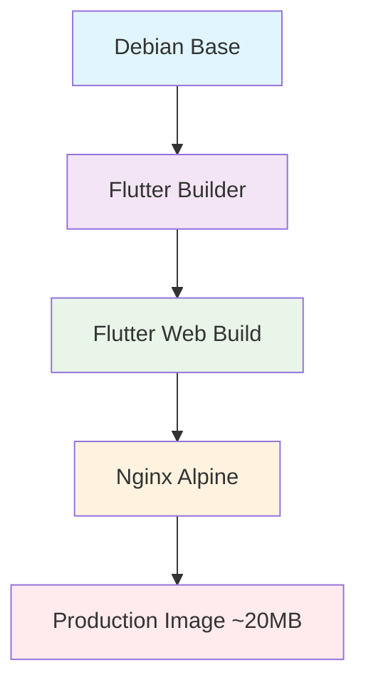
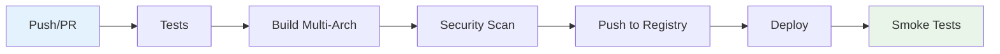

# 🐳 PDV Restaurant - Guia Completo Docker

> **Sistema PDV moderno para restaurantes com Docker profissional**
> 
> Este guia contém todas as informações necessárias para usar, deployar e manter o sistema PDV Restaurant usando Docker.

[](https://hub.docker.com)
[](https://hub.docker.com)
[](https://hub.docker.com)
[](https://github.com)

---

## 📋 Índice

- [🚀 Início Rápido](#-início-rápido)
- [🏗️ Arquitetura](#️-arquitetura)
- [📦 Imagem Docker](#-imagem-docker)
- [🛠️ Desenvolvimento](#️-desenvolvimento)
- [🚀 Produção](#-produção)
- [⚙️ Configuração](#️-configuração)
- [🔧 Scripts de Automação](#-scripts-de-automação)
- [📊 Monitoramento](#-monitoramento)
- [🔒 Segurança](#-segurança)
- [🚨 Troubleshooting](#-troubleshooting)
- [📈 Performance](#-performance)

---

## 🚀 Início Rápido

### Executar via Docker Hub (Mais Rápido)

```bash
# Executar a versão mais recente
docker run -d -p 8080:8080 --name pdv-restaurant pdv-restaurant:latest

# Acessar aplicação
open http://localhost:8080
```

### Build Local

```bash
# Clonar repositório
git clone https://github.com/seu-usuario/pdv-restaurant.git
cd pdv-restaurant

# Build e execução
./scripts/docker-build.sh deploy
```

### Docker Compose (Recomendado)

```bash
# Desenvolvimento
docker-compose up -d

# Produção
docker-compose -f docker-compose.prod.yml up -d
```

---

## 🏗️ Arquitetura

### Multi-Stage Build



### Componentes

| Componente | Versão | Finalidade |
|------------|--------|------------|
| **Flutter** | 3.24.5 | Build da aplicação web |
| **Nginx** | 1.25-alpine | Servidor web otimizado |
| **Base Image** | Alpine Linux | Segurança e tamanho mínimo |

### Otimizações

- ✅ **Multi-stage build** - Reduz tamanho final
- ✅ **Cache layers** - Build mais rápido
- ✅ **Multi-arch support** - AMD64 + ARM64
- ✅ **Non-root user** - Segurança aprimorada
- ✅ **Compressão gzip** - Performance web
- ✅ **Health checks** - Monitoramento automático

---

## 📦 Imagem Docker

### Especificações Técnicas

```yaml
Base Image: nginx:1.25-alpine
Final Size: ~20MB (comprimido)
Platforms: linux/amd64, linux/arm64
User: non-root (appuser:1001)
Port: 8080
Health Check: /health endpoint
```

### Variáveis de Ambiente

```bash
# Nginx Configuration
NGINX_WORKER_PROCESSES=auto
NGINX_WORKER_CONNECTIONS=1024
NGINX_KEEPALIVE_TIMEOUT=65
NGINX_CLIENT_MAX_BODY_SIZE=10m

# Application
TZ=America/Sao_Paulo
```

### Build Arguments

```dockerfile
# Configurações de build
ARG FLUTTER_WEB_RENDERER=canvaskit
ARG BUILD_MODE=release
ARG BASE_HREF=/
ARG BUILD_DATE
ARG VCS_REF
ARG VERSION
```

---

## 🛠️ Desenvolvimento

### Configuração de Desenvolvimento

```bash
# Iniciar ambiente de desenvolvimento
docker-compose up -d

# Verificar logs
docker-compose logs -f

# Acessar aplicação
open http://localhost:3000
```

### Hot Reload

O ambiente de desenvolvimento suporta **hot reload** completo:

```yaml
# docker-compose.yml
volumes:
  - ./lib:/app/lib:delegated          # Código fonte
  - ./web:/app/web:delegated          # Arquivos web
  - ./assets:/app/assets:delegated    # Assets
  - ./pubspec.yaml:/app/pubspec.yaml:delegated
```

### Debug

```bash
# Executar com debug
docker-compose exec pdv-dev flutter run -d web-server --web-port=3000 --debug

# Acessar debug port
open http://localhost:9999
```

### Profiles

```bash
# Apenas aplicação
docker-compose up -d

# Com nginx proxy
docker-compose --profile with-nginx up -d

# Com monitoramento
docker-compose --profile monitoring up -d
```

---

## 🚀 Produção

### Deploy Simples

```bash
# Via script automatizado
./scripts/docker-build.sh deploy -t v2.0.0

# Manual
docker build -t pdv-restaurant:v2.0.0 .
docker run -d -p 8080:8080 pdv-restaurant:v2.0.0
```

### Docker Compose Produção

```bash
# Iniciar stack completa de produção
docker-compose -f docker-compose.prod.yml up -d

# Com load balancer e SSL
docker-compose -f docker-compose.prod.yml --profile traefik up -d

# Com monitoramento
docker-compose -f docker-compose.prod.yml --profile monitoring up -d
```

### Configurações de Produção

```yaml
# docker-compose.prod.yml
services:
  pdv-app:
    deploy:
      resources:
        limits:
          cpus: '0.5'
          memory: 512M
        reservations:
          cpus: '0.1'
          memory: 128M
    restart: unless-stopped
    healthcheck:
      interval: 30s
      timeout: 10s
      retries: 3
```

### Scaling

```bash
# Escalar horizontalmente
docker-compose -f docker-compose.prod.yml up -d --scale pdv-app=3

# Com load balancer automático
docker-compose -f docker-compose.prod.yml --profile traefik up -d --scale pdv-app=3
```

---

## ⚙️ Configuração

### Nginx Customizado

Arquivo [`nginx.conf`](./nginx.conf) otimizado para Flutter Web:

```nginx
# Principais configurações
✅ SPA routing support
✅ Compressão gzip otimizada
✅ Cache headers inteligentes
✅ Headers de segurança
✅ PWA support
✅ Health check endpoint
```

### SSL/TLS (Produção)

```yaml
# docker-compose.prod.yml
traefik:
  command:
    - "--certificatesresolvers.letsencrypt.acme.httpchallenge=true"
    - "--certificatesresolvers.letsencrypt.acme.email=${ACME_EMAIL}"
  labels:
    - "traefik.http.routers.pdv-prod.tls.certresolver=letsencrypt"
```

### Variáveis de Ambiente

```bash
# .env
DOMAIN=pdv-restaurant.com
ACME_EMAIL=admin@pdv-restaurant.com
DOCKER_USERNAME=seu-usuario
DOCKER_PASSWORD=sua-senha
GRAFANA_PASSWORD=senha-segura
VERSION=2.0.0
```

---

## 🔧 Scripts de Automação

### Script Principal: `scripts/docker-build.sh`

```bash
# Comandos disponíveis
./scripts/docker-build.sh build     # Build da imagem
./scripts/docker-build.sh push      # Push para registry
./scripts/docker-build.sh run       # Executar container
./scripts/docker-build.sh test      # Testes automatizados
./scripts/docker-build.sh deploy    # Deploy completo
./scripts/docker-build.sh clean     # Limpeza de recursos
./scripts/docker-build.sh dev       # Ambiente desenvolvimento
./scripts/docker-build.sh prod      # Ambiente produção
./scripts/docker-build.sh health    # Health check
./scripts/docker-build.sh logs      # Visualizar logs
```

### Opções Avançadas

```bash
# Build com opções customizadas
./scripts/docker-build.sh build \
  --tag v2.0.0 \
  --platforms linux/amd64,linux/arm64 \
  --renderer canvaskit \
  --mode release \
  --push

# Deploy com configurações específicas
REGISTRY=ghcr.io \
IMAGE_NAME=empresa/pdv-restaurant \
./scripts/docker-build.sh deploy --tag latest
```

### Automação CI/CD

O script integra perfeitamente com GitHub Actions:

```yaml
# .github/workflows/docker-build.yml
- name: Build and deploy
  run: |
    chmod +x ./scripts/docker-build.sh
    ./scripts/docker-build.sh deploy --tag ${{ github.sha }} --push
```

---

## 📊 Monitoramento

### Health Checks

```bash
# Verificar saúde dos containers
curl http://localhost:8080/health

# Via script
./scripts/docker-build.sh health
```

### Métricas com Prometheus

```yaml
# docker-compose.prod.yml --profile monitoring
prometheus:
  image: prom/prometheus:latest
  ports:
    - "9090:9090"

grafana:
  image: grafana/grafana:latest
  ports:
    - "3001:3000"
```

### Logs Estruturados

```bash
# Ver logs em tempo real
docker-compose logs -f

# Logs específicos do nginx
docker-compose exec pdv-app tail -f /var/log/nginx/access.log

# Logs em formato JSON
docker-compose exec pdv-app tail -f /var/log/nginx/access.log | jq
```

### Dashboards

- **Grafana**: `http://localhost:3001` (admin/senha-configurada)
- **Prometheus**: `http://localhost:9090`
- **Portainer**: `http://localhost:9000` (desenvolvimento)

---

## 🔒 Segurança

### Práticas Implementadas

- ✅ **Non-root user** - Container roda como `appuser:1001`
- ✅ **Minimal base image** - Alpine Linux
- ✅ **Security headers** - CSP, HSTS, X-Frame-Options
- ✅ **Vulnerability scanning** - Trivy integration
- ✅ **Secrets management** - Docker secrets support
- ✅ **Network isolation** - Custom networks

### Headers de Segurança

```nginx
# nginx.conf
add_header X-Frame-Options "SAMEORIGIN" always;
add_header X-XSS-Protection "1; mode=block" always;
add_header X-Content-Type-Options "nosniff" always;
add_header Referrer-Policy "no-referrer-when-downgrade" always;
add_header Content-Security-Policy "default-src 'self'; ..." always;
```

### Scan de Vulnerabilidades

```bash
# Trivy scan
docker run --rm -v /var/run/docker.sock:/var/run/docker.sock \
  aquasec/trivy image pdv-restaurant:latest

# Via GitHub Actions (automático)
```

### Secrets

```bash
# Docker secrets (produção)
echo "senha-secreta" | docker secret create db_password -
docker service create --secret db_password pdv-restaurant:latest
```

---

## 🚨 Troubleshooting

### Problemas Comuns

#### Container não inicia

```bash
# Verificar logs
docker logs pdv-restaurant-container

# Verificar configuração
docker inspect pdv-restaurant-container

# Testar health check
curl -f http://localhost:8080/health
```

#### Build falha

```bash
# Limpar cache Docker
docker builder prune -a

# Build com logs verbosos
./scripts/docker-build.sh build --verbose --no-cache

# Verificar dependências
./scripts/docker-build.sh build --dry-run
```

#### Performance baixa

```bash
# Verificar recursos
docker stats

# Analisar nginx
docker exec pdv-container nginx -T

# Verificar logs de erro
docker logs pdv-container 2>&1 | grep -i error
```

### Comandos Úteis

```bash
# Debug interativo
docker run -it --rm pdv-restaurant:latest sh

# Verificar configuração nginx
docker exec pdv-container nginx -t

# Recarregar configuração nginx
docker exec pdv-container nginx -s reload

# Backup de volumes
docker run --rm -v pdv_data:/data -v $(pwd):/backup alpine tar czf /backup/backup.tar.gz /data
```

---

## 📈 Performance

### Otimizações Implementadas

#### Build Time
- ✅ **Multi-stage build** - Apenas arquivos necessários
- ✅ **Layer caching** - Reutilização de camadas
- ✅ **Dependency caching** - Cache do pub get
- ✅ **Parallel builds** - Multi-platform simultâneo

#### Runtime
- ✅ **Gzip compression** - Redução de 70% no tamanho
- ✅ **Static asset caching** - Cache de 1 ano para assets
- ✅ **HTTP/2 ready** - Multiplexing support
- ✅ **Resource limits** - Controle de CPU/Memory

#### Métricas Esperadas

| Métrica | Valor Esperado |
|---------|----------------|
| **Build time** | < 5 minutos |
| **Image size** | < 50 MB |
| **Memory usage** | < 128 MB |
| **CPU usage** | < 0.1 core |
| **Startup time** | < 10 segundos |
| **Response time** | < 100ms |

### Benchmarks

```bash
# Load testing com Apache Bench
ab -n 1000 -c 10 http://localhost:8080/

# Performance monitoring
docker stats --format "table {{.Container}}\t{{.CPUPerc}}\t{{.MemUsage}}\t{{.MemPerc}}"
```

---

## 🔄 CI/CD Pipeline

### GitHub Actions

Fluxo automático configurado em [`.github/workflows/docker-build.yml`](.github/workflows/docker-build.yml):



### Configuração de Secrets

No GitHub, configure os seguintes secrets:

```bash
DOCKER_USERNAME      # Username do Docker Hub
DOCKER_PASSWORD      # Token do Docker Hub
SLACK_WEBHOOK_URL    # Webhook para notificações (opcional)
```

### Deploy Automático

```yaml
# Trigger automático no push para main
on:
  push:
    branches: [ main ]
    tags: [ 'v*' ]
```

---

## 📝 Exemplos de Uso

### Desenvolvimento Local

```bash
# Início rápido desenvolvimento
git clone https://github.com/seu-usuario/pdv-restaurant.git
cd pdv-restaurant
docker-compose up -d
open http://localhost:3000
```

### Staging Environment

```bash
# Deploy em ambiente de staging
export DOMAIN=staging.pdv-restaurant.com
export VERSION=staging-$(git rev-parse --short HEAD)
./scripts/docker-build.sh deploy --tag $VERSION
```

### Produção com SSL

```bash
# Deploy produção completo
export DOMAIN=pdv-restaurant.com
export ACME_EMAIL=admin@pdv-restaurant.com
docker-compose -f docker-compose.prod.yml --profile traefik up -d
```

### Backup e Restore

```bash
# Backup volumes
docker run --rm -v nginx_logs:/data -v $(pwd):/backup alpine tar czf /backup/logs-backup.tar.gz /data

# Restore volumes
docker run --rm -v nginx_logs:/data -v $(pwd):/backup alpine tar xzf /backup/logs-backup.tar.gz -C /
```

---

## 🤝 Contribuindo

### Como Contribuir

1. **Fork** o repositório
2. **Clone** seu fork
3. **Crie** uma branch para sua feature
4. **Teste** com Docker localmente
5. **Submeta** um Pull Request

### Testando Mudanças

```bash
# Testar build local
./scripts/docker-build.sh build --tag test

# Executar testes
./scripts/docker-build.sh test --tag test

# Verificar segurança
docker run --rm -v /var/run/docker.sock:/var/run/docker.sock \
  aquasec/trivy image pdv-restaurant:test
```

---

## 📞 Suporte

### Canais de Suporte

- 📧 **Email**: suporte@pdv-restaurant.com
- 💬 **Discord**: [PDV Restaurant Community](https://discord.gg/pdv-restaurant)
- 🐛 **Issues**: [GitHub Issues](https://github.com/seu-usuario/pdv-restaurant/issues)
- 📖 **Docs**: [Documentação Completa](https://docs.pdv-restaurant.com)

### FAQ

**Q: Como atualizar para nova versão?**
```bash
docker pull pdv-restaurant:latest
docker-compose up -d
```

**Q: Como fazer backup dos dados?**
```bash
./scripts/docker-build.sh backup
```

**Q: Como configurar SSL personalizado?**
```bash
# Edite docker-compose.prod.yml e configure volumes para certificados
```

---

## 📄 Licença

Este projeto está licenciado sob a [MIT License](LICENSE).

---

## 🎯 Roadmap

- [ ] **Multi-region deployment**
- [ ] **Kubernetes support**
- [ ] **Enhanced monitoring**
- [ ] **Automated backup system**
- [ ] **Performance optimization**
- [ ] **Advanced security features**

---

<div align="center">

**🐳 PDV Restaurant Docker Setup**

*Desenvolvido com ❤️ pela equipe PDV Restaurant*

[](https://hub.docker.com)
[](https://github.com)

</div>