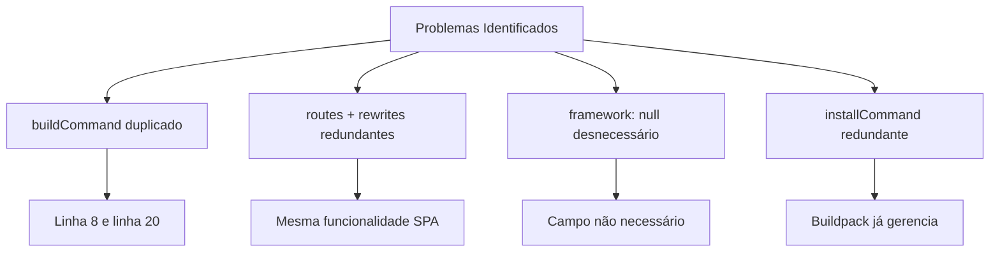

# Análise e Recomendações para Deploy Flutter Web na Vercel

## 📋 Situação Atual

O projeto `pdv_restaurant` está atualmente configurado com:

- **Buildpack oficial**: `@dart-lang/flutter@latest`
- **Comando de build**: `flutter build web --release --no-tree-shake-icons`
- **Diretório de saída**: `build/web`
- **Configuração de roteamento**: SPA com fallback para `index.html`

## 🔍 Análise Comparativa das Abordagens

### 1. Buildpack Oficial da Vercel (`@dart-lang/flutter@latest`) - **RECOMENDADO**

#### ✅ Vantagens
- **Manutenção automática**: A Vercel mantém o buildpack atualizado
- **Otimização nativa**: Configurações otimizadas para a plataforma Vercel
- **Simplicidade**: Configuração mais limpa e fácil de manter
- **Cache inteligente**: Sistema de cache automático para dependências
- **Suporte oficial**: Documentação e suporte direto da Vercel
- **Performance superior**: Builds mais rápidos e eficientes

#### ❌ Desvantagens
- **Menos controle**: Limitado às configurações disponíveis no buildpack
- **Versão do Flutter**: Dependente da versão mantida pela Vercel

### 2. Script Customizado Proposto

```bash
if cd flutter; then git pull && cd .. ; else git clone https://github.com/flutter/flutter.git; fi && ls && flutter/bin/flutter doctor && flutter/bin/flutter clean && flutter/bin/flutter config --enable-web
```

#### ✅ Vantagens
- **Controle total**: Versão específica do Flutter
- **Flexibilidade**: Comandos customizados e configurações específicas
- **Debugging**: Mais visibilidade no processo de build

#### ❌ Desvantagens
- **Complexidade**: Mais propenso a erros e difícil de manter
- **Performance**: Builds significativamente mais lentos (clone do repositório Flutter)
- **Cache ineficiente**: Sem otimizações de cache da Vercel
- **Manutenção**: Responsabilidade de manter o script atualizado
- **Recursos**: Maior consumo de recursos de build
- **Reliability**: Dependente de conectividade externa durante o build

## 🎯 Recomendação Final

**MANTENHA O BUILDPACK OFICIAL** pelos seguintes motivos técnicos:

1. **Projeto Flutter Padrão**: O projeto segue a estrutura padrão do Flutter sem customizações que exijam configurações especiais

2. **Dependências Compatíveis**: Todas as dependências no `pubspec.yaml` são compatíveis com Flutter web padrão:
   - UI: `fluent_ui`, `fluentui_icons`
   - State Management: `riverpod`, `flutter_riverpod`
   - Storage: `hive`, `hive_flutter`
   - Network: `dio`, `connectivity_plus`

3. **Performance**: O buildpack oficial é otimizado para a infraestrutura da Vercel

4. **Manutenibilidade**: Menos pontos de falha e manutenção mais simples

## 🔧 Otimizações Identificadas no vercel.json Atual

### Problemas na Configuração Atual



### Configuração Otimizada Recomendada

```json
{
  "version": 2,
  "builds": [
    {
      "src": "pubspec.yaml",
      "use": "@dart-lang/flutter@latest",
      "config": {
        "buildCommand": "flutter build web --release --no-tree-shake-icons --dart-define=WEB_RENDERER=canvaskit"
      }
    }
  ],
  "rewrites": [
    {
      "source": "/(.*)",
      "destination": "/index.html"
    }
  ],
  "headers": [
    {
      "source": "/flutter_service_worker.js",
      "headers": [
        {
          "key": "Cache-Control",
          "value": "public, max-age=0, must-revalidate"
        }
      ]
    },
    {
      "source": "/(.*\\.(js|css|woff2?|png|jpe?g|svg|gif|ico))",
      "headers": [
        {
          "key": "Cache-Control",
          "value": "public, max-age=31536000, immutable"
        }
      ]
    }
  ]
}
```

### Melhorias Implementadas

1. **Remoção de duplicações**: Eliminado `buildCommand` e `installCommand` redundantes
2. **Simplificação de rotas**: Usar apenas `rewrites` (mais moderno que `routes`)
3. **Limpeza de campos**: Removido `framework: null` desnecessário
4. **Otimização de renderização**: Adicionado `--dart-define=WEB_RENDERER=canvaskit` para melhor performance
5. **Configuração de cache**: Headers otimizados para assets estáticos e service worker
6. **Estrutura limpa**: Configuração mais enxuta e focada

## 📈 Benefícios da Configuração Otimizada

### Performance
- **Builds mais rápidos**: Remoção de redundâncias
- **Cache otimizado**: Headers específicos para diferentes tipos de arquivo
- **Renderização melhorada**: CanvasKit para melhor performance em desktop

### Manutenibilidade
- **Configuração mais limpa**: Menos linhas, mais focada
- **Menos pontos de falha**: Remoção de configurações redundantes
- **Padrões modernos**: Uso de `rewrites` ao invés de `routes`

### Compatibilidade
- **PWA Ready**: Configuração otimizada para Progressive Web Apps
- **Mobile friendly**: Cache adequado para diferentes dispositivos
- **SEO friendly**: Configuração de SPA adequada

## 🚀 Próximos Passos

1. **Implementar a configuração otimizada** no `vercel.json`
2. **Testar o deploy** para verificar se tudo funciona corretamente
3. **Monitorar performance** após as mudanças
4. **Documentar** as alterações para a equipe

## 📊 Conclusão

A configuração atual com o buildpack oficial `@dart-lang/flutter@latest` é a **abordagem correta** para este projeto. As otimizações propostas melhorarão a performance e manutenibilidade sem adicionar complexidade desnecessária.

**Recomendação final**: Mantenha o buildpack oficial e implemente as otimizações sugeridas no `vercel.json`.