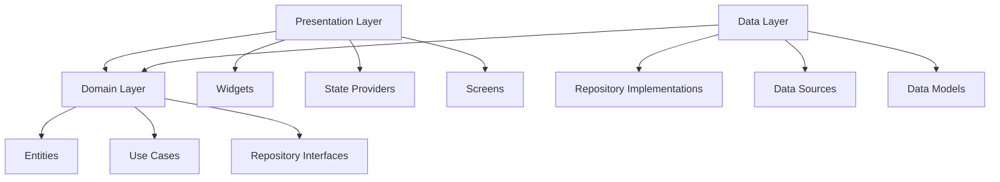

# Architecture
{: .no_toc }

Documentação completa da arquitetura e padrões de design utilizados no PDV Restaurant.
{: .fs-6 .fw-300 }

## Índice
{: .no_toc .text-delta }

1. TOC
{:toc}

---

## Visão Geral

O PDV Restaurant foi desenvolvido seguindo os princípios da **Clean Architecture**, garantindo:

- 🏗️ **Separação de responsabilidades**
- 🔄 **Facilidade de manutenção**
- 🧪 **Testabilidade**
- 🔌 **Baixo acoplamento**
- 📈 **Escalabilidade**

---

## Clean Architecture

### Camadas da Arquitetura



### 1. Domain Layer (Camada de Domínio)

**Responsabilidade**: Contém a lógica de negócio pura, independente de frameworks.

```
lib/features/[feature]/domain/
├── entities/           # Entidades de negócio
├── repositories/       # Interfaces dos repositórios
└── use_cases/         # Casos de uso
```

#### Entities (Entidades)

```dart
// lib/features/products/domain/entities/product_entity.dart
class ProductEntity extends Entity {
  final String id;
  final String name;
  final String description;
  final double price;
  final String imageUrl;
  final String categoryId;
  final bool isAvailable;
  final int availableQuantity;
  
  // Regras de negócio
  bool get isLowStock => availableQuantity <= 5 && availableQuantity > 0;
  bool get isOutOfStock => availableQuantity == 0;
  String get formattedPrice => Money(price).formatted;
}
```

#### Use Cases (Casos de Uso)

```dart
// lib/features/products/domain/use_cases/get_available_products.dart
class GetAvailableProducts {
  final ProductRepository repository;
  
  GetAvailableProducts(this.repository);
  
  Future<Either<Failure, List<ProductEntity>>> call() async {
    return await repository.getAvailableProducts();
  }
}
```

#### Repository Interfaces

```dart
// lib/features/products/domain/repositories/product_repository.dart
abstract class ProductRepository {
  Future<Either<Failure, List<ProductEntity>>> getAvailableProducts();
  Future<Either<Failure, List<ProductEntity>>> searchProducts(String query);
  Future<Either<Failure, List<ProductEntity>>> getProductsByCategory(String categoryId);
}
```

### 2. Data Layer (Camada de Dados)

**Responsabilidade**: Implementa as interfaces do domínio e gerencia fontes de dados.

```
lib/features/[feature]/data/
├── models/            # Modelos de dados
├── repositories/      # Implementações dos repositórios
└── datasources/       # Fontes de dados (local/remote)
```

#### Data Models

```dart
// lib/features/products/data/models/product_model.dart
class ProductModel extends ProductEntity {
  ProductModel({
    required super.id,
    required super.name,
    required super.description,
    required super.price,
    required super.imageUrl,
    required super.categoryId,
    required super.isAvailable,
    required super.availableQuantity,
  });
  
  factory ProductModel.fromJson(Map<String, dynamic> json) {
    return ProductModel(
      id: json['id'],
      name: json['name'],
      // ... outros campos
    );
  }
  
  Map<String, dynamic> toJson() {
    return {
      'id': id,
      'name': name,
      // ... outros campos
    };
  }
}
```

#### Repository Implementation

```dart
// lib/features/products/data/repositories/product_repository_impl.dart
class ProductRepositoryImpl implements ProductRepository {
  final ProductLocalDataSource localDataSource;
  final ProductRemoteDataSource remoteDataSource;
  final NetworkInfo networkInfo;
  
  ProductRepositoryImpl({
    required this.localDataSource,
    required this.remoteDataSource,
    required this.networkInfo,
  });
  
  @override
  Future<Either<Failure, List<ProductEntity>>> getAvailableProducts() async {
    if (await networkInfo.isConnected) {
      try {
        final products = await remoteDataSource.getAvailableProducts();
        await localDataSource.cacheProducts(products);
        return Right(products);
      } catch (e) {
        return Left(ServerFailure());
      }
    } else {
      try {
        final products = await localDataSource.getCachedProducts();
        return Right(products);
      } catch (e) {
        return Left(CacheFailure());
      }
    }
  }
}
```

### 3. Presentation Layer (Camada de Apresentação)

**Responsabilidade**: Gerencia a interface do usuário e estado da aplicação.

```
lib/features/[feature]/presentation/
├── providers/         # Providers do Riverpod
├── widgets/          # Widgets específicos da feature
└── pages/            # Páginas/telas
```

#### State Management com Riverpod

```dart
// lib/features/products/presentation/providers/products_provider.dart
final productsProvider = StateNotifierProvider<ProductsNotifier, ProductsState>(
  (ref) => ProductsNotifier(
    getAvailableProducts: ref.read(getAvailableProductsProvider),
    searchProducts: ref.read(searchProductsProvider),
  ),
);

class ProductsNotifier extends StateNotifier<ProductsState> {
  final GetAvailableProducts getAvailableProducts;
  final SearchProducts searchProducts;
  
  ProductsNotifier({
    required this.getAvailableProducts,
    required this.searchProducts,
  }) : super(ProductsInitial());
  
  Future<void> loadProducts() async {
    state = ProductsLoading();
    
    final result = await getAvailableProducts();
    
    result.fold(
      (failure) => state = ProductsError(failure.message),
      (products) => state = ProductsLoaded(products),
    );
  }
}
```

---

## Dependency Injection

### GetIt Configuration

```dart
// lib/core/services/dependency_injection.dart
final getIt = GetIt.instance;

Future<void> initializeDependencies() async {
  // External
  getIt.registerLazySingleton<NetworkInfo>(() => NetworkInfoImpl());
  
  // Data sources
  getIt.registerLazySingleton<ProductLocalDataSource>(
    () => ProductLocalDataSourceImpl(),
  );
  
  // Repositories
  getIt.registerLazySingleton<ProductRepository>(
    () => ProductRepositoryImpl(
      localDataSource: getIt(),
      remoteDataSource: getIt(),
      networkInfo: getIt(),
    ),
  );
  
  // Use cases
  getIt.registerLazySingleton(() => GetAvailableProducts(getIt()));
  getIt.registerLazySingleton(() => SearchProducts(getIt()));
}
```

### Riverpod Providers

```dart
// lib/core/providers/providers.dart
final getAvailableProductsProvider = Provider<GetAvailableProducts>(
  (ref) => getIt<GetAvailableProducts>(),
);

final searchProductsProvider = Provider<SearchProducts>(
  (ref) => getIt<SearchProducts>(),
);
```

---

## State Management

### Riverpod Architecture

```dart
// Estado da aplicação
abstract class ProductsState extends Equatable {
  const ProductsState();
  
  @override
  List<Object> get props => [];
}

class ProductsInitial extends ProductsState {}

class ProductsLoading extends ProductsState {}

class ProductsLoaded extends ProductsState {
  final List<ProductEntity> products;
  
  const ProductsLoaded(this.products);
  
  @override
  List<Object> get props => [products];
}

class ProductsError extends ProductsState {
  final String message;
  
  const ProductsError(this.message);
  
  @override
  List<Object> get props => [message];
}
```

### Consumer Widgets

```dart
// Widget que consome o estado
class ProductsList extends ConsumerWidget {
  @override
  Widget build(BuildContext context, WidgetRef ref) {
    final productsState = ref.watch(productsProvider);
    
    return productsState.when(
      data: (products) => ListView.builder(
        itemCount: products.length,
        itemBuilder: (context, index) => ProductCard(products[index]),
      ),
      loading: () => const CircularProgressIndicator(),
      error: (error, stack) => Text('Erro: $error'),
    );
  }
}
```

---

## Error Handling

### Failure Classes

```dart
// lib/core/error/failures.dart
abstract class Failure extends Equatable {
  final String message;
  
  const Failure(this.message);
  
  @override
  List<Object> get props => [message];
}

class ServerFailure extends Failure {
  const ServerFailure([String message = 'Erro do servidor']) : super(message);
}

class CacheFailure extends Failure {
  const CacheFailure([String message = 'Erro de cache']) : super(message);
}

class NetworkFailure extends Failure {
  const NetworkFailure([String message = 'Erro de rede']) : super(message);
}
```

### Either Pattern

```dart
// Uso do Either para tratamento de erros
Future<Either<Failure, List<ProductEntity>>> getProducts() async {
  try {
    final products = await dataSource.getProducts();
    return Right(products);
  } on ServerException {
    return Left(ServerFailure());
  } on CacheException {
    return Left(CacheFailure());
  }
}
```

---

## Data Persistence

### Hive Configuration

```dart
// lib/core/storage/hive_config.dart
class HiveConfig {
  static Future<void> init() async {
    await Hive.initFlutter();
    
    // Registrar adapters
    Hive.registerAdapter(ProductModelAdapter());
    Hive.registerAdapter(CartItemModelAdapter());
    
    // Abrir boxes
    await Hive.openBox<ProductModel>('products');
    await Hive.openBox<CartItemModel>('cart');
  }
}
```

### Local Data Source

```dart
// lib/features/products/data/datasources/product_local_data_source.dart
class ProductLocalDataSourceImpl implements ProductLocalDataSource {
  final Box<ProductModel> box;
  
  ProductLocalDataSourceImpl(this.box);
  
  @override
  Future<List<ProductModel>> getCachedProducts() async {
    return box.values.toList();
  }
  
  @override
  Future<void> cacheProducts(List<ProductModel> products) async {
    await box.clear();
    for (final product in products) {
      await box.put(product.id, product);
    }
  }
}
```

---

## Testing Strategy

### Unit Tests

```dart
// test/features/products/domain/use_cases/get_available_products_test.dart
void main() {
  late GetAvailableProducts useCase;
  late MockProductRepository mockRepository;
  
  setUp(() {
    mockRepository = MockProductRepository();
    useCase = GetAvailableProducts(mockRepository);
  });
  
  group('GetAvailableProducts', () {
    test('should return products when repository call is successful', () async {
      // arrange
      final products = [ProductEntity(...)];
      when(mockRepository.getAvailableProducts())
          .thenAnswer((_) async => Right(products));
      
      // act
      final result = await useCase();
      
      // assert
      expect(result, Right(products));
      verify(mockRepository.getAvailableProducts());
    });
  });
}
```

### Widget Tests

```dart
// test/features/products/presentation/widgets/product_card_test.dart
void main() {
  testWidgets('ProductCard should display product information', (tester) async {
    // arrange
    final product = ProductEntity(...);
    
    // act
    await tester.pumpWidget(
      MaterialApp(
        home: ProductCard(product),
      ),
    );
    
    // assert
    expect(find.text(product.name), findsOneWidget);
    expect(find.text(product.formattedPrice), findsOneWidget);
  });
}
```

---

## Performance Optimizations

### Lazy Loading

```dart
// Carregamento sob demanda de imagens
class ProductImage extends StatelessWidget {
  final String imageUrl;
  
  @override
  Widget build(BuildContext context) {
    return Image.asset(
      imageUrl,
      loadingBuilder: (context, child, loadingProgress) {
        if (loadingProgress == null) return child;
        return CircularProgressIndicator();
      },
      errorBuilder: (context, error, stackTrace) {
        return Icon(Icons.error);
      },
    );
  }
}
```

### Memoization

```dart
// Cache de resultados computacionais
final expensiveComputationProvider = Provider.family<String, int>((ref, id) {
  return ref.watch(dataProvider.select((data) => 
    data.where((item) => item.id == id).first.expensiveComputation()
  ));
});
```

---

## Security Considerations

### Input Validation

```dart
// lib/shared/domain/value_objects/money.dart
class Money extends ValueObject<double> {
  @override
  final double value;
  
  const Money._(this.value);
  
  factory Money(double input) {
    if (input < 0) {
      throw ArgumentError('Money cannot be negative');
    }
    return Money._(input);
  }
  
  String get formatted => NumberFormat.currency(
    locale: 'pt_BR',
    symbol: 'R\$',
  ).format(value);
}
```

### Data Sanitization

```dart
// lib/core/utils/input_sanitizer.dart
class InputSanitizer {
  static String sanitizeString(String input) {
    return input
        .trim()
        .replaceAll(RegExp(r'[<>\"\'%;()&+]'), '');
  }
  
  static double sanitizePrice(String input) {
    final cleaned = input.replaceAll(RegExp(r'[^\d.,]'), '');
    return double.tryParse(cleaned.replaceAll(',', '.')) ?? 0.0;
  }
}
```

---

## Monitoring and Logging

### Logger Configuration

```dart
// lib/core/services/logger_service.dart
class LoggerService {
  static final Logger _logger = Logger(
    printer: PrettyPrinter(
      methodCount: 2,
      errorMethodCount: 8,
      lineLength: 120,
      colors: true,
      printEmojis: true,
      printTime: true,
    ),
  );
  
  static void info(String message) => _logger.i(message);
  static void warning(String message) => _logger.w(message);
  static void error(String message, [dynamic error, StackTrace? stackTrace]) {
    _logger.e(message, error, stackTrace);
  }
}
```

---

## Conclusão

A arquitetura do PDV Restaurant foi cuidadosamente projetada para ser:

- **Escalável**: Fácil adição de novas funcionalidades
- **Testável**: Cada camada pode ser testada independentemente
- **Manutenível**: Código organizado e bem estruturado
- **Flexível**: Fácil adaptação a mudanças de requisitos

Esta arquitetura garante que o projeto possa crescer e evoluir mantendo a qualidade e performance.